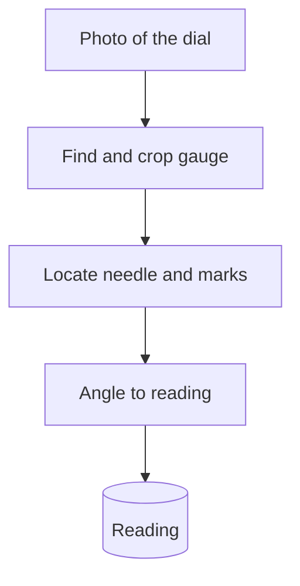

<b>Read an analogue water gauge from a phone photo, no smart meter needed</b>

قراءة مقاييس الضغط والتدفق التناظرية من صورة بالهاتف، دون الحاجة إلى عدّادات ذكية

<b>Status:</b> Field pilot · one village since June 2026 · accuracy not yet measured &nbsp;·&nbsp; <b>Built by</b> <a href="https://github.com/Mohanad1st">Mohannad Hesham</a>

> Case study only: the source is private because it runs on live field sites and is still a pilot. Walkthrough on request.

## The problem

At rural water sites in Egypt, pressure and flow are still shown on analogue dials, and someone has to walk to each one, read the needle and write the number down. Smart meters would fix that, but they cost more than most small systems can carry. WaterEye tests a cheaper route: a field operator points a phone or a fixed camera at the dial, and the system turns the photo into a logged reading.

## What it does

- Finds each gauge in a photo and crops it, even when several dials are in one shot
- Reads the needle position against the dial's minimum and maximum marks and turns it into a number
- Works from a phone photo or a snapshot from a fixed site camera
- A dashboard prototype for stations, alerts and history (not yet connected to live readings)

## See it

How the work flows:

Screens are not shown: the dashboard is a prototype without live data, and field photos show real sites.

## Built with

Python · YOLO-based detection · geometric needle reading (not OCR) · a web dashboard prototype with role-based access

## Built responsibly

- Honest status first: one village, since June 2026, and accuracy has not been measured yet
- The dashboard prototype has role-based access for admins, engineers and operators, with row-level rules switched on
- Readings are treated as numbers to check, not decisions, until accuracy is measured against manual readings

## What it deliberately doesn't do

- It is not a validated metering system yet. Until accuracy is measured against manual readings, it supports people rather than replacing them.
- It does not control pumps or valves; it only reads dials.

## More from Life From Water

- [Ameen](https://github.com/Mohanad1st/ameen-showcase) — A finance desk you talk to, built to stop donation money being misfiled
- [LFW HR System](https://github.com/Mohanad1st/lfw-hr-system-showcase) — Attendance, leave, overtime and approvals for a field NGO, in Arabic and English
- [Life From Water — donation platform](https://github.com/Mohanad1st/lifefromwater-website-showcase) — Donations and impact you can check, for a water-access NGO in rural Egypt
- [Opportunity Studio](https://github.com/Mohanad1st/opportunity-studio-showcase) — An evidence-first pipeline for grants, fellowships and tenders

---

© 2026 Mohannad Hesham. Showcase text and images only — no source code is published or licensed here. See all my work on <a href="https://github.com/Mohanad1st">my GitHub profile</a> · <a href="https://www.linkedin.com/in/mohannadhesham/">LinkedIn</a>.
