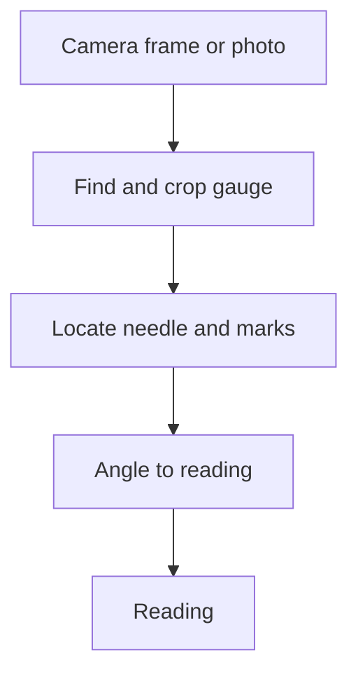

<b>Read an analogue pressure or flow gauge from a photo, with no smart meter</b>

قراءة مقاييس الضغط والتدفق التناظرية من صورة، دون الحاجة إلى عدّادات ذكية

<b>Status:</b> Field pilot · one village since June 2026 · accuracy not yet measured &nbsp;·&nbsp; <b>Built by</b> <a href="https://github.com/Mohanad1st">Mohannad Hesham</a>

> This is a case study. The source is private because it runs at a live field site and is still a pilot.

## Why we built it

At our rural water sites, pressure and flow still show on analogue dials. Someone has to walk to each one, read the needle and write it down. When we priced sensors for our own small village plants, they cost more than the plant itself. So we're testing a cheaper route: point a camera at the dial and turn the picture into a reading.

## What it does

- Finds each gauge in a camera frame and crops it, even when several dials are in one shot.
- Reads the needle against the dial's minimum and maximum marks, and turns the angle into a number.
- Works from a phone photo or a fixed site camera.
- A dashboard prototype for stations, alerts and history. It isn't connected to live readings yet.

## How it works

Screens aren&#x27;t shown: the dashboard is a prototype without live data, and field photos show real sites.

## What it's built on

Python · YOLO-based detection · geometric needle reading (not OCR) · a web dashboard prototype with role-based access

## Safeguards

- The dashboard prototype has roles for admins, engineers and operators, with row-level access rules switched on.

## What's not solved yet

- Accuracy hasn't been measured, so a reading should be checked against a manual one. Readings aren't stored yet.

## What it doesn't do

- It's not a validated metering system yet.
- It doesn't control pumps or valves. It only reads dials.

## More from Life From Water

- [Ameen](https://github.com/Mohanad1st/ameen-showcase) — A finance desk you talk to, built to stop donation money being misfiled
- [LFW HR System](https://github.com/Mohanad1st/lfw-hr-system-showcase) — Attendance, leave, overtime and approvals for our field staff, in Arabic and English
- [Life From Water: donation platform](https://github.com/Mohanad1st/lifefromwater-website-showcase) — A donation platform in the making, with impact you can check, for our water-access work in rural Egypt
- [Opportunity Studio](https://github.com/Mohanad1st/opportunity-studio-showcase) — An evidence-first pipeline for grants, fellowships and tenders

---

© 2026 Mohannad Hesham. Showcase text and images only — no source code is published or licensed here. See all my work on <a href="https://github.com/Mohanad1st">my GitHub profile</a> · <a href="https://www.linkedin.com/in/mohannadhesham/">LinkedIn</a>.
